## Managing CDE Spark Jobs

# CDE API Lab

API Lab for Cloudera Data Engineering DS 1.5.5

### Summary

In this Hands on Lab you will create a Data Engineering pipeline with PySpark, Iceberg, and Airflow. Along the way, you will gain hands on experience with Spark dependency management, the API, and git integration for DevOps.

### Requirements

* CDP DS 1.5.5. on Cloudera ECS or OCP
* At least CDE Virtual Cluster with 125 Cores and 125 GB Mem for every 12 participants

### Labs

#### Lab 1: Familiarize yourself with the CDE Architecture and UX

In this lab you will learn about CDE Services, Virtual Clusters, and Resources.

Cloudera Data Engineering (CDE) is a service for Cloudera Data Platform that allows you to submit batch jobs to auto-scaling virtual clusters. CDE enables you to spend more time on your applications, and less time on infrastructure.

Cloudera Data Engineering allows you to create, manage, and schedule Apache Spark jobs without the overhead of creating and maintaining Spark clusters. With Cloudera Data Engineering, you define virtual clusters with a range of CPU and memory resources, and the cluster scales up and down as needed to run your Spark workloads, helping to control your cloud costs.

The CDE Service can be reached from the CDP Home Page by clicking on the blue "Data Engineering" icon.

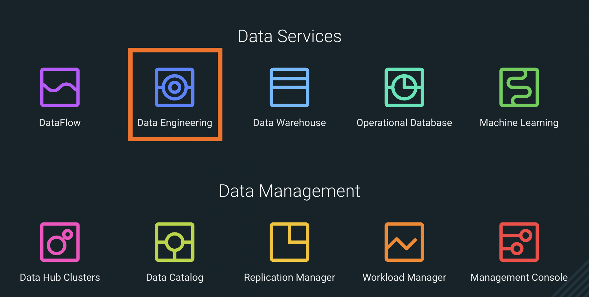

The CDE Landing Page allows you to access, create and manage CDE Services and Virtual Clusters. Within each CDE Service you can deploy one or more CDE Virtual Cluster. In the Virtual Cluster you can create, monitor and troubleshoot Spark and Airflow Jobs.

The CDE Service is pegged to the CDP Environment. Each CDE Service is mapped to at most one CDP Environment while a CDP Environment can map to one or more CDE Services.

These are the most important components in the CDE Service:

##### CDP Environment
A logical subset of your cloud provider account including a specific virtual network. CDP Environments can be in AWS, Azure, RedHat OCP and Cloudera ECS. For more information, see [CDP Environments](https://docs.cloudera.com/management-console/cloud/overview/topics/mc-core-concepts.html). Practically speaking, an environment is equivalent to a Data Lake as each environment is automatically associated with its own SDX services for Security, Governance and Lineage.

##### CDE Service
The long-running Kubernetes cluster and services that manage the CDE Virtual Clusters. The CDE Service must be enabled on an environment before you can create any CDE Virtual Clusters.

##### CDE Virtual Cluster
An individual auto-scaling cluster with predefined CPU and memory ranges. Virtual Clusters in CDE can be created and deleted on demand. Jobs are associated with clusters. When deploying a Virtual Cluster you can choose between two Cluster Tiers:

*Core (Tier 1)*: Batch-based transformation and engineering options include:
* Autoscaling Cluster
* Spot Instances
* SDX/Lakehouse
* Job Lifecycle
* Monitoring
* Workflow Orchestration

*All Purpose (Tier 2)*: Develop using interactive sessions and deploy both batch and streaming workloads. This option includes all options in Tier 1 with the addition of the  following:
* Shell Sessions - CLI and Web
* JDBC/SparkSQL (Coming in October 2023 with CDE 1.20)
* IDE (Coming in October 2023 with CDE 1.20)

Core clusters are recommended as Production environments. All Purpose clusters are instead designed to be used as Development and Testing environments.
For more information on the CDE 1.23 release please visit this page in the [documentation](https://docs.cloudera.com/data-engineering/cloud/release-notes/topics/cde-whats-new-1.23.0.html).

##### Jobs
Application code along with defined configurations and resources. Jobs can be run on demand or scheduled. An individual job execution is called a job run.

##### Resource
A defined collection of files such as a Python file or application JAR, dependencies, and any other reference files required for a job.

##### Job Run
An individual job run.

##### CDE Session

CDE interactive sessions give data engineers flexible end-points to start developing Spark applications from anywhere -- in a web-based terminal, local CLI, favorite IDE, and even via JDBC from third-party tools.

##### Apache Iceberg

Apache Iceberg is a cloud-native, high-performance open table format for organizing petabyte-scale analytic datasets on a file system or object store. Combined with Cloudera Data Platform (CDP), users can build an open data lakehouse architecture for multi-function analytics and to deploy large scale end-to-end pipelines.

Open Data Lakehouse on CDP simplifies advanced analytics on all data with a unified platform for structured and unstructured data and integrated data services to enable any analytics use case from ML, BI to stream analytics and real-time analytics. Apache Iceberg is the secret sauce of the open lakehouse.

Iceberg is compatible with a variety of compute engines including Spark. CDE allows you to deploy Iceberg-enabled Virtual Clusters.

For more information please visit the [documentation](https://iceberg.apache.org/).

##### CDE User Interface

Now that you have covered the basics of CDE, spend a few moments familiarizing yourself with the CDE Landing page.

The Home Page provides a high level overview of all CDE Services and Clusters. At the top, you have shortcuts to creating CDE Jobs and Resources.

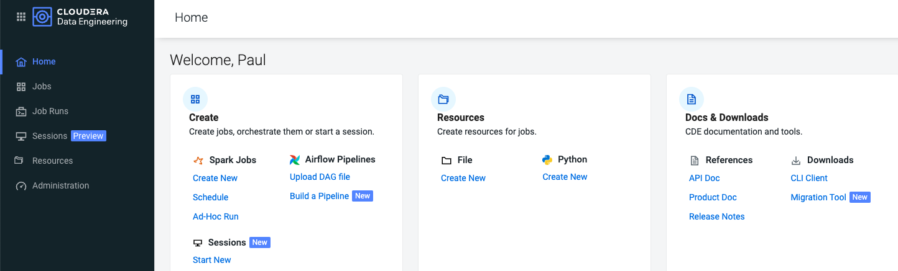

Scroll down to the CDE Virtual Clusters section and notice that all Virtual Clusters and each associated CDP Environment / CDE Service are shown.

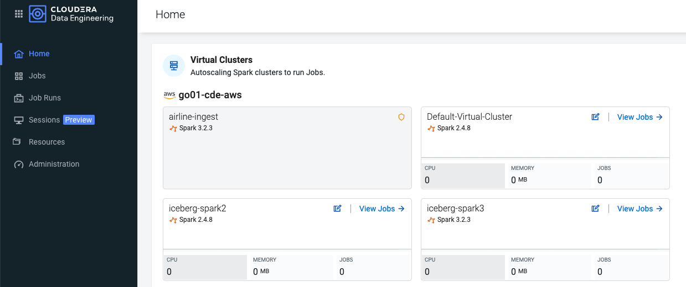

Next, open the Administration page on the left tab. This page also shows CDE Services on the left and associated Virtual Clusters on the right.

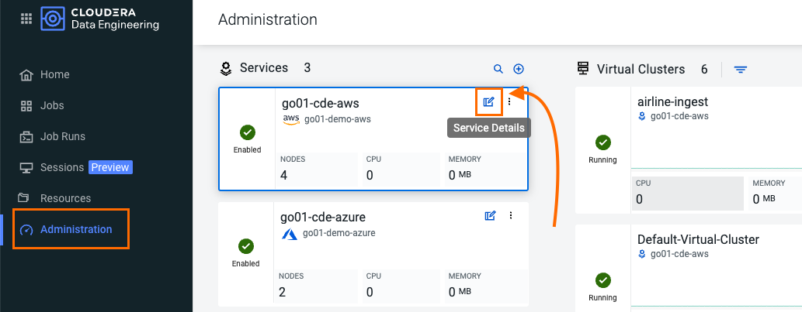

Open the CDE Service Details page and notice the following key information and links:

* CDE Version
* Nodes Autoscale Range
* CDP Data Lake and Environment
* Graphana Charts. Click on this link to obtain a dashboard of running Service Kubernetes resources.
* Resource Scheduler. Click on this link to view the Yunikorn Web UI.

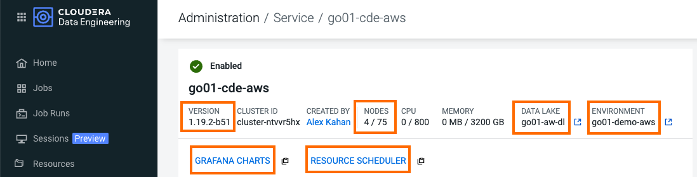

Scroll down and open the Configurations tab. Notice that this is where Instance Types and Instance Autoscale ranges are defined.

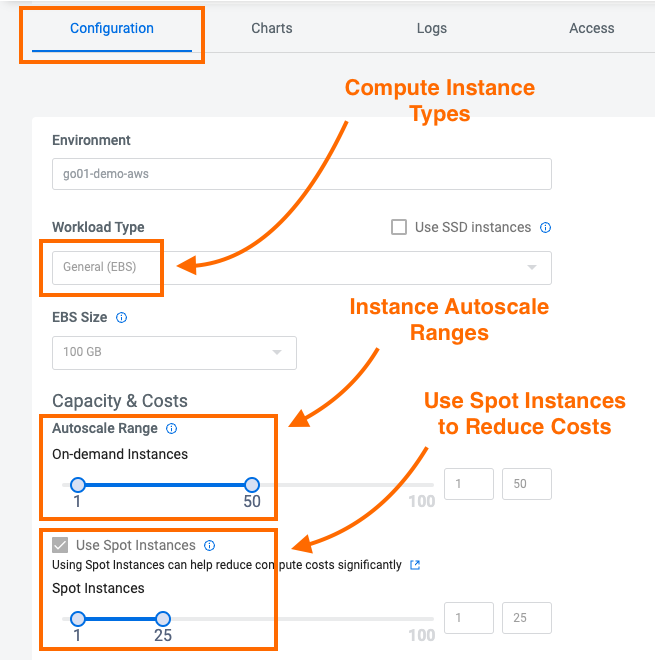

To learn more about other important service configurations please visit [Enabling a CDE Service](https://docs.cloudera.com/data-engineering/cloud/enable-data-engineering/topics/cde-enable-data-engineering.html) in the CDE Documentation.

Navigate back to the Administration page and open a Virtual Cluster's Cluster Details page.

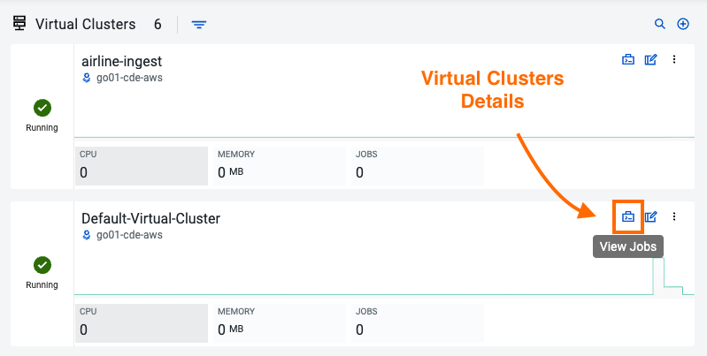

This view includes other important cluster management information. From here you can:

* Download the CDE CLI binaries. The CLI is recommended to submit jobs and interact with CDE. It is covered in Part 3 of this guide.
* Visit the API Docs to learn the CDE API and build sample requests on the Swagger page.
* Access the Airflow UI to monitor your Airflow Jobs, set up custom connections, variables, and more.  

Open the Configuration tab. Notice that you can select between Core and All Purpose Tier Clusters.
In addition, this view provides options to set CPU and Memory autoscale ranges, Spark version, and Iceberg options are set here.
CDE supports Spark 3.3.

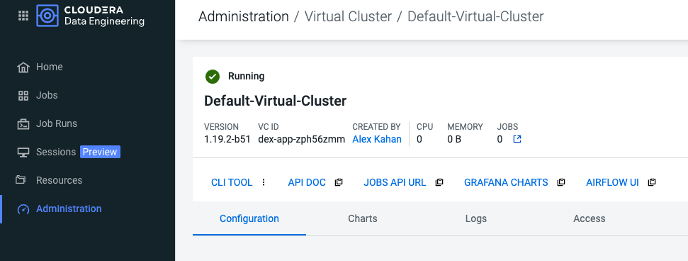

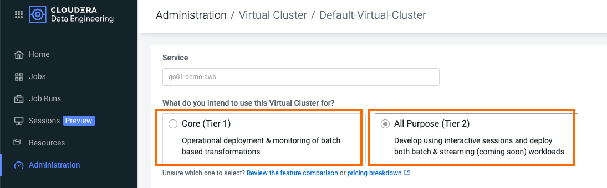

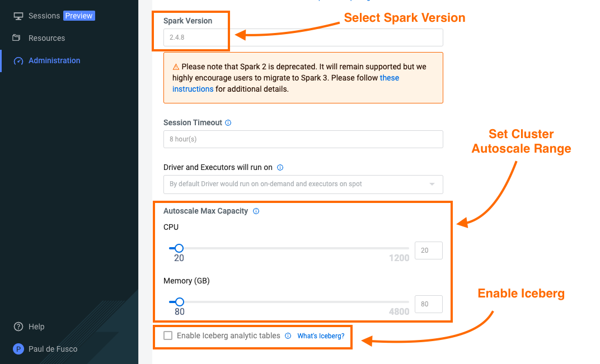

To learn more about CDE Architecture please visit [Creating and Managing Virtual Clusters](https://docs.cloudera.com/data-engineering/cloud/manage-clusters/topics/cde-create-cluster.html) and [Recommendations for Scaling CDE Deployments](https://docs.cloudera.com/data-engineering/cloud/deployment-architecture/topics/cde-general-scaling.html)

#### Lab 2: Create your First CDE Spark Job

Using the UI, you will build a CDE Repository and CDE Spark Job. Then, you will run the Job and learn about CDE built-in Observability features.

```
export CDE_JOB_URL="https://9dzt9w5g.cde-s9225lcp.se-sandb.a465-9q4k.cloudera.site/dex/api/v1"
```

```
export CDE_TOKEN=$(curl -s -u pauldefusco https://service.cde-s9225lcp.se-sandb.a465-9q4k.cloudera.site/gateway/authtkn/knoxtoken/api/v1/token | jq -r '.access_token')
```

Test your API setup with a simple request to list jobs:

```
curl -H "Authorization: Bearer ${CDE_TOKEN}" -X GET "${CDE_JOB_URL}/jobs?latestjob=false&filter=name%5Beq%5DmyJob&limit=20&offset=0&orderasc=true"      
```

If that returned a succesful response, you're ready to move on to the lab.

Create a CDE Repository:

```
curl -H "Authorization: Bearer ${CDE_TOKEN}" -X 'POST' "${CDE_JOB_URL}/repositories" \
  -H "accept: application/json" -H "Content-Type: application/json" \
  -d '{
  "git": {
    "branch": "main",
    "insecureSkipTLS": true,
    "repository": "https://github.com/pdefusco/CDE_Custom_Labs.git"
  },
  "name": "myRepo",
  "skipCredentialValidation": true
}'
```

```
curl -H "Authorization: Bearer ${CDE_TOKEN}" -X 'POST' "${CDE_JOB_URL}/repositories/myRepo" \
  -H "accept: application/json" -H "Content-Type: application/json"
```

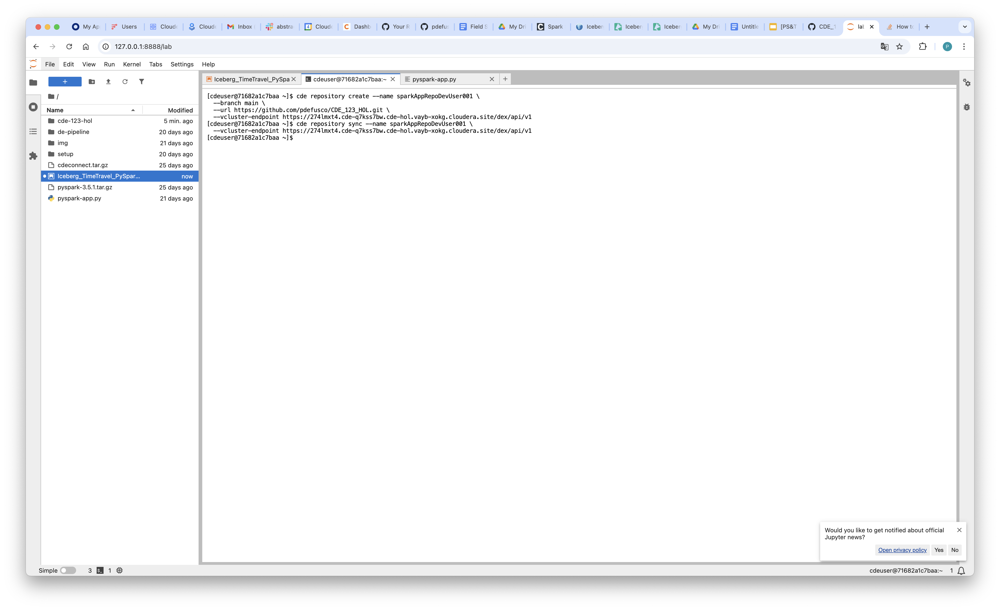

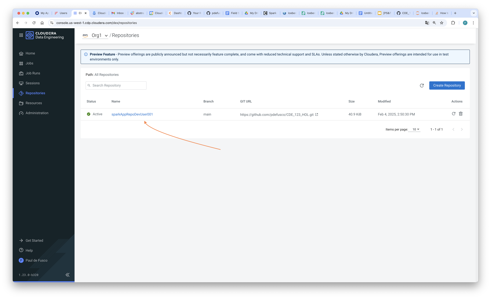

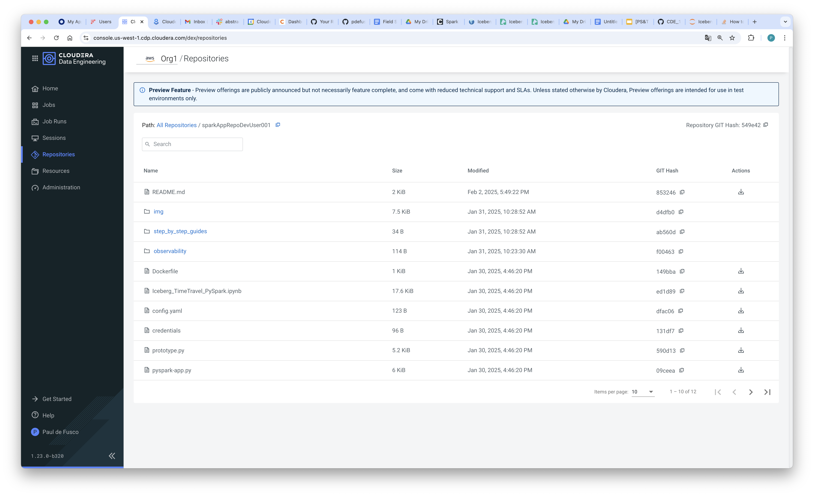

```
curl -H "Authorization: Bearer ${CDE_TOKEN}" \
  -X 'POST' '${CDE_JOB_URL}/jobs' \
  -H 'accept: application/json' \
  -H 'Content-Type: application/json' \
  -d '{
  "mounts": [
    {
      "dirPrefix": "string",
      "resourceName": "string"
    }
  ],
  "name": "myIcebergJob",
  "spark": {
    "args": [
      "string"
    ],
    "conf": {
      "additionalProp1": "string",
      "additionalProp2": "string",
      "additionalProp3": "string"
    },
    "driverCores": 1,
    "driverMemory": "string",
    "executorCores": 2,
    "executorMemory": "2g",
    "file": "string",
    "logLevel": "string",
    "name": "string",
    "numExecutors": 1,
    "proxyUser": "string",
    "pythonEnvResourceName": "string"
  },
  "type": "spark",
}'
```

```
curl -H "Authorization: Bearer ${CDE_TOKEN}" \
  -X 'POST' '${CDE_JOB_URL}/jobs/myJob/run' \
  -H 'accept: application/json' \
  -H 'Content-Type: application/json' \
  -d '{
  "overrides": {
    "spark": {
      "args": [
        "string"
      ],
      "conf": {
        "additionalProp1": "string",
        "additionalProp2": "string",
        "additionalProp3": "string"
      },
      "driverCores": 1,
      "driverMemory": "1g",
      "executorCores": 2,
      "executorMemory": "2g",
      "file": "string",
      "logLevel": "string",
      "name": "myJob",
      "numExecutors": 1
    }
  },
  "requestID": "string",
  "user": "string",
  "variables": {
    "additionalProp1": "string",
    "additionalProp2": "string",
    "additionalProp3": "string"
  }
}'
```

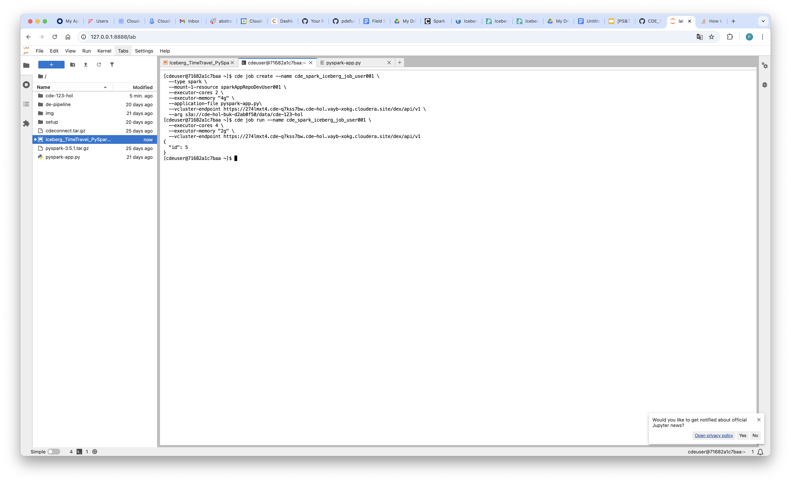

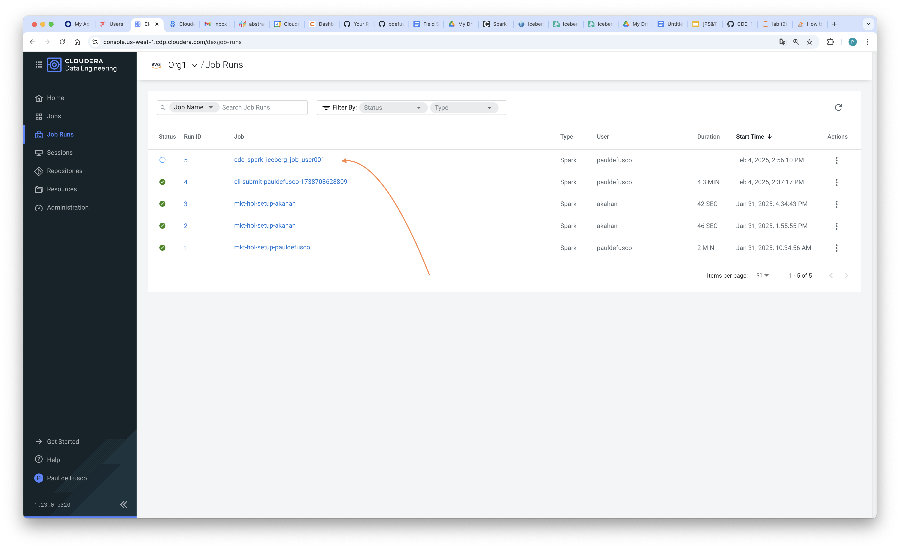


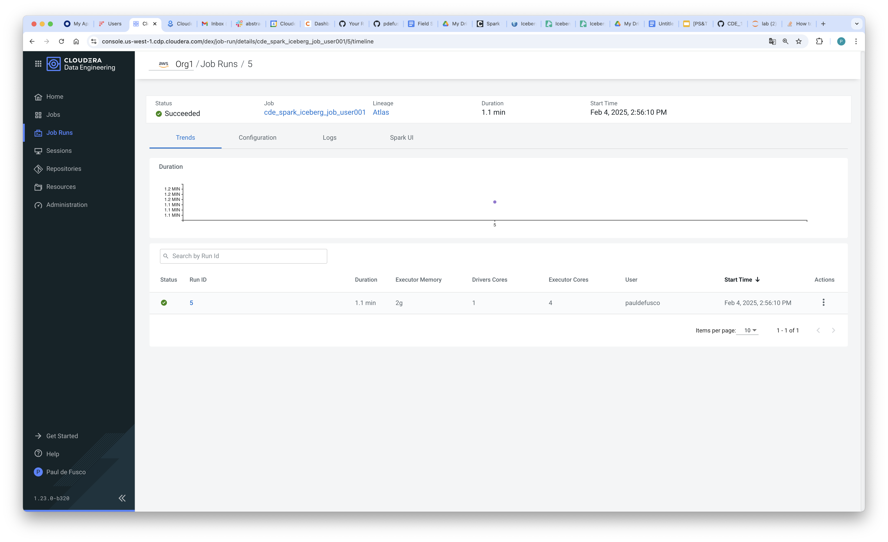

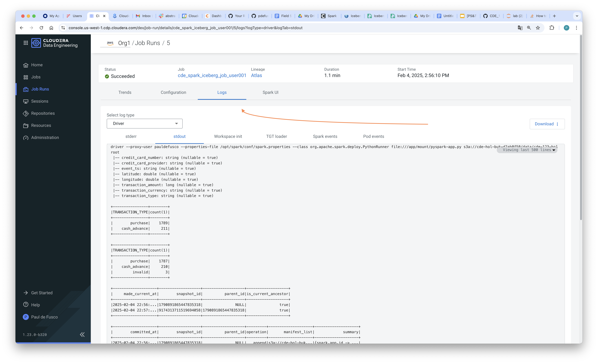

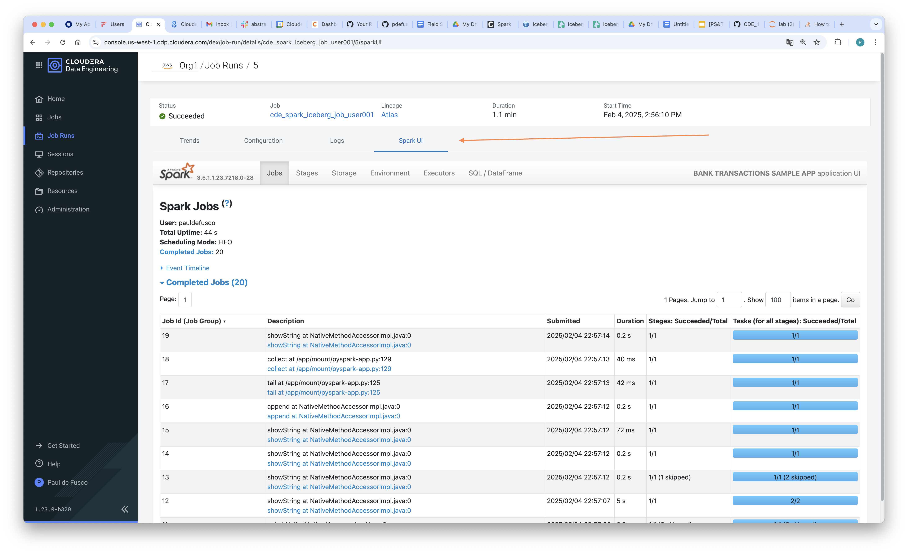

#### Lab 3: Create your First CDE Spark and Iceberg Job

Using the API, run a CDE Spark Submit with the provided Pyspark and Iceberg application. Navigate to the CDE UI and look at the standard output.

```
curl -H "Authorization: Bearer ${CDE_TOKEN}" \
  -X 'POST' '${CDE_JOB_URL}/jobs' \
  -H 'accept: application/json' \
  -H 'Content-Type: application/json' \
  -d '{
  "defaultVariables": {
    "additionalProp1": "string",
    "additionalProp2": "string",
    "additionalProp3": "string"
  },
  "hidden": true,
  "mounts": [
    {
      "dirPrefix": "string",
      "resourceName": "string"
    }
  ],
  "name": "icebergApp",
  "pipeline": {
    "resource": {
      "name": "string",
      "path": "string"
    },
    "source": "string"
  },
  "spark": {
    "args": [
      "string"
    ],
    "conf": {
      "additionalProp1": "string",
      "additionalProp2": "string",
      "additionalProp3": "string"
    },
    "driverCores": 1,
    "driverMemory": "1g",
    "executorCores": 2,
    "executorMemory": "2g",
    "file": "string",
    "name": "icebergApp",
    "numExecutors": 1
  },
  "type": "spark"
}'
```

```
curl -H "Authorization: Bearer ${CDE_TOKEN}" \
  -X 'POST' "${CDE_JOB_URL}/jobs/myJob/run" \
  -H 'accept: application/json' \
  -H 'Content-Type: application/json' \
  -d '{
  "hidden": true,
  "overrides": {
    "spark": {
      "args": [
        "string"
      ],
      "conf": {
        "additionalProp1": "string",
        "additionalProp2": "string",
        "additionalProp3": "string"
      },
      "driverCores": 1,
      "driverMemory": "1g",
      "executorCores": 2,
      "executorMemory": "2g",
      "file": "string",
      "name": "icebergApp",
      "numExecutors": 1
    }
  },
  "variables": {
    "additionalProp1": "string",
    "additionalProp2": "string",
    "additionalProp3": "string"
  }
}'
```


#### Lab 4: Use the API to explore CDE Job Runs, Definitions, and Artifacts

Explore jobs:

```
curl -H "Authorization: Bearer ${CDE_TOKEN}" \
  -X 'GET' \
  "${CDE_JOB_URL}/jobs?latestjob=false&filter=name%5Beq%5DmyJob&limit=20&offset=0&orderasc=true" \
  -H 'accept: application/json'
```

Filter all jobs where job application file equals "code/spark_geospatial.py":

```
curl -H "Authorization: Bearer ${CDE_TOKEN}" \
  -X 'GET' \
  "${CDE_JOB_URL}/jobs?latestjob=false&filter=spark.file%5Beq%5Dcode%2FmyApp.py&limit=20&offset=0&orderasc=true" \
  -H 'accept: application/json'
```

You can use different operators. For example, search all jobs whose name contains "spark":

```
curl -H "Authorization: Bearer ${CDE_TOKEN}" \
  -X 'GET' \
  "${CDE_JOB_URL}/jobs?latestjob=false&filter=name%5Brlike%5Dspark&limit=20&offset=0&orderasc=true" \
  -H 'accept: application/json'
```

Search all jobs created on or after 11/23/23:

```
curl -H "Authorization: Bearer ${CDE_TOKEN}" \
  -X 'GET' \
  '${CDE_JOB_URL}/jobs?latestjob=false&filter=created%5Bgte%5D2023-11-23&limit=20&offset=0&orderasc=true' \
  -H 'accept: application/json'
```

Search all jobs with executorCores less than 2:

```
curl -H "Authorization: Bearer ${CDE_TOKEN}" \
  -X 'GET' \
  '${CDE_JOB_URL}/jobs?latestjob=false&filter=spark.executorCores%5Blt%5D2&limit=20&offset=0&orderasc=true' \
  -H 'accept: application/json'
```

List all runs for job "geospatialRdd":

```
curl -H "Authorization: Bearer ${CDE_TOKEN}" \
  -X 'GET' \
  '${CDE_JOB_URL}/job-runs?filter=job%5Beq%5DgeospatialRdd&limit=20&offset=0&orderby=ID&orderasc=true' \
  -H 'accept: application/json'
```

You can combine multiple filters. Return all job runs from today (11/29/23) i.e. where the start date is greater than or equal to 11/29 and the end date is less than or equal to 11/30. Notice all times default to +00 UTC timezone.

```
curl -H "Authorization: Bearer ${CDE_TOKEN}" \
  -X 'GET' \
  '${CDE_JOB_URL}/job-runs?filter=started%5Bgte%5D2023-11-29%20AND%20ended%5Blte%5D2023-11-30&limit=20&offset=0&orderby=ID&orderasc=true' \
  -H 'accept: application/json'
```

List all successful airflow jobs run by user pauldefusco that started after 3 am UTC on 11/29/23:

```
curl -H "Authorization: Bearer ${CDE_TOKEN}" \
  -X 'GET' \
  '${CDE_JOB_URL}/job-runs?filter=type%5Beq%5Dairflow%20AND%20status%5Beq%5Dsucceeded%20AND%20user%5Beq%5Dpauldefusco%20AND%20started%5Bgte%5D2023-11-29T03'\''&limit=20&offset=0&orderby=ID&orderasc=true' \
  -H 'accept: application/json'
```

List all CDE Resources will return all types ("python-env", "files", "custom-runtime-image"):

```
curl -H "Authorization: Bearer ${CDE_TOKEN}" \
  -X 'GET' \
  '${CDE_JOB_URL}/resources?includeFiles=false&limit=20&offset=0&orderby=name&orderasc=true' \
  -H 'accept: application/json'
```

List all CDE Resources named "myScripts":

```
curl -H "Authorization: Bearer ${CDE_TOKEN}" \
  -X 'GET' \
  '${CDE_JOB_URL}/resources?includeFiles=false&filter=name%5Beq%5DmyScripts&limit=20&offset=0&orderby=name&orderasc=true' \
  -H 'accept: application/json'
```

List all CDE Resources of type Python Environment:

```
curl -H "Authorization: Bearer ${CDE_TOKEN}" \
  -X 'GET' \
  '${CDE_JOB_URL}/resources?includeFiles=false&filter=type%5Beq%5Dpython-env&limit=20&offset=0&orderby=name&orderasc=true' \
  -H 'accept: application/json'
```

#### Lab 5: Use the API to create a CDE Airflow Pipeline for Iceberg WAP

Create the CDE Spark jobs. Notice these are categorized into Bronze, Silver and Gold following a Lakehouse Data Architecture.

```
curl -H "Authorization: Bearer ${CDE_TOKEN}" \
  -X 'POST' \
  '${CDE_JOB_URL}/jobs' \
  -H 'accept: application/json' \
  -H 'Content-Type: application/json' \
  -d '{
  "defaultVariables": {
    "additionalProp1": "string",
    "additionalProp2": "string",
    "additionalProp3": "string"
  },
  "hidden": true,
  "mounts": [
    {
      "dirPrefix": "string",
      "resourceName": "string"
    }
  ],
  "name": "cde_spark_job_bronze_user001",
  "spark": {
    "args": [
      "string"
    ],
    "conf": {
      "additionalProp1": "string",
      "additionalProp2": "string",
      "additionalProp3": "string"
    },
    "driverCores": 1,
    "driverMemory": "1g",
    "executorCores": 2,
    "executorMemory": "2g",
    "file": "string",
    "name": "string",
    "numExecutors": 1,
    "proxyUser": "string",
    "pythonEnvResourceName": "string"
  },
  "type": "spark"
}'
```

```
curl -H "Authorization: Bearer ${CDE_TOKEN}" \
  -X 'POST' \
  '${CDE_JOB_URL}/jobs' \
  -H 'accept: application/json' \
  -H 'Content-Type: application/json' \
  -d '{
  "defaultVariables": {
    "additionalProp1": "string",
    "additionalProp2": "string",
    "additionalProp3": "string"
  },
  "hidden": true,
  "mounts": [
    {
      "dirPrefix": "string",
      "resourceName": "string"
    }
  ],
  "name": "cde_spark_job_silver_user001",
  "spark": {
    "args": [
      "string"
    ],
    "conf": {
      "additionalProp1": "string",
      "additionalProp2": "string",
      "additionalProp3": "string"
    },
    "driverCores": 1,
    "driverMemory": "1g",
    "executorCores": 2,
    "executorMemory": "2g",
    "file": "string",
    "logLevel": "string",
    "name": "string",
    "numExecutors": 1,
    "proxyUser": "string",
    "pythonEnvResourceName": "string"
  },
  "type": "spark"
}'
```

```
curl -H "Authorization: Bearer ${CDE_TOKEN}" \
  -X 'POST' \
  '${CDE_JOB_URL}/jobs' \
  -H 'accept: application/json' \
  -H 'Content-Type: application/json' \
  -d '{
  "defaultVariables": {
    "additionalProp1": "string",
    "additionalProp2": "string",
    "additionalProp3": "string"
  },
  "hidden": true,
  "mounts": [
    {
      "dirPrefix": "string",
      "resourceName": "string"
    }
  ],
  "name": "cde_spark_job_gold_user001",
  "spark": {
    "args": [
      "string"
    ],
    "conf": {
      "additionalProp1": "string",
      "additionalProp2": "string",
      "additionalProp3": "string"
    },
    "driverCores": 1,
    "driverMemory": "1g",
    "executorCores": 2,
    "executorMemory": "2g",
    "file": "string",
    "logLevel": "string",
    "name": "string",
    "numExecutors": 1,
    "proxyUser": "string",
    "pythonEnvResourceName": "string"
  },
  "type": "string"
}'
```

In your editor, open the Airflow DAG "004_airflow_dag_git" and edit your username variable at line 54.

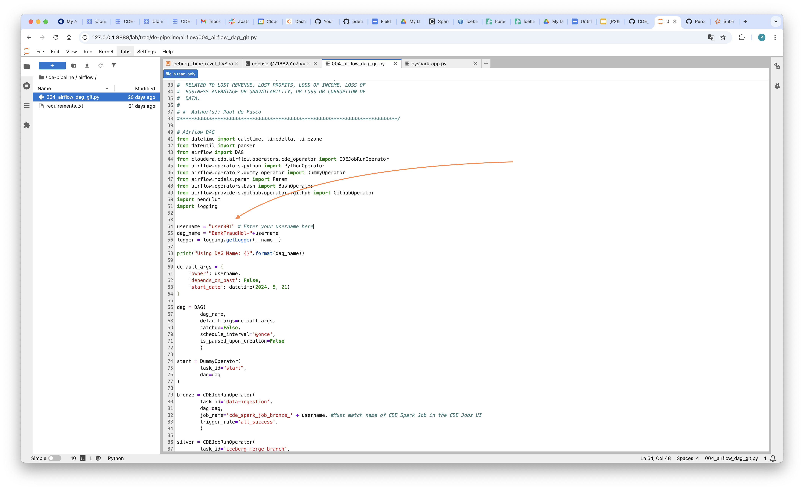

Then create the CDE Airflow job. This job will orchestrate your Lakehouse Spark jobs above.

```
curl -H "Authorization: Bearer ${CDE_TOKEN}" \
  -X 'POST' \
  '${CDE_JOB_URL}/jobs' \
  -H 'accept: application/json' \
  -H 'Content-Type: application/json' \
  -d '{
  "airflow": {
    "conf": {
      "additionalProp1": {}
    },
    "config": {
      "additionalProp1": "string",
      "additionalProp2": "string",
      "additionalProp3": "string"
    },
    "dagFile": "string",
    "fileMounts": [
      {
        "dirPrefix": "string",
        "resourceName": "string"
      }
    ]
  },
  "mounts": [
    {
      "dirPrefix": "string",
      "resourceName": "string"
    }
  ],
  "name": "string",
  "schedule": {
    "catchup": true,
    "enabled": true,
    "end": "string",
    "nextExecution": "string",
    "paused": true,
    "pausedUponCreation": true,
    "start": "string",
    "user": "string"
  },
  "type": "string",
}'
```

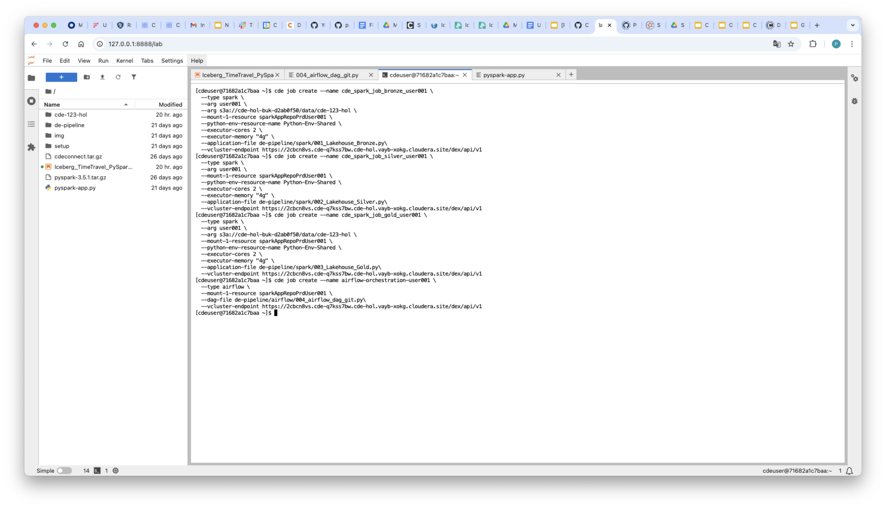

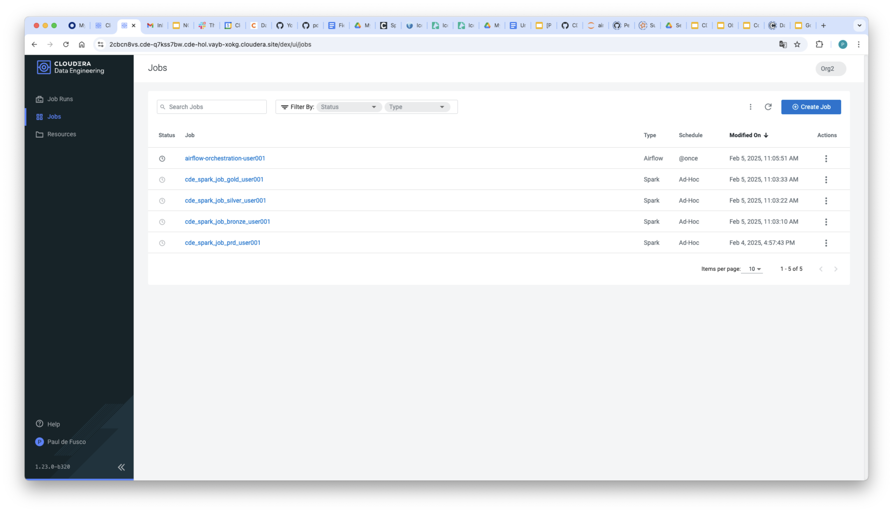

There is no need to manually trigger the Airflow job run. The DAG parameters already include a schedule. Upon creation, the CDE Airflow Job will run shortly. You can follow along progress in the Job Runs UI.

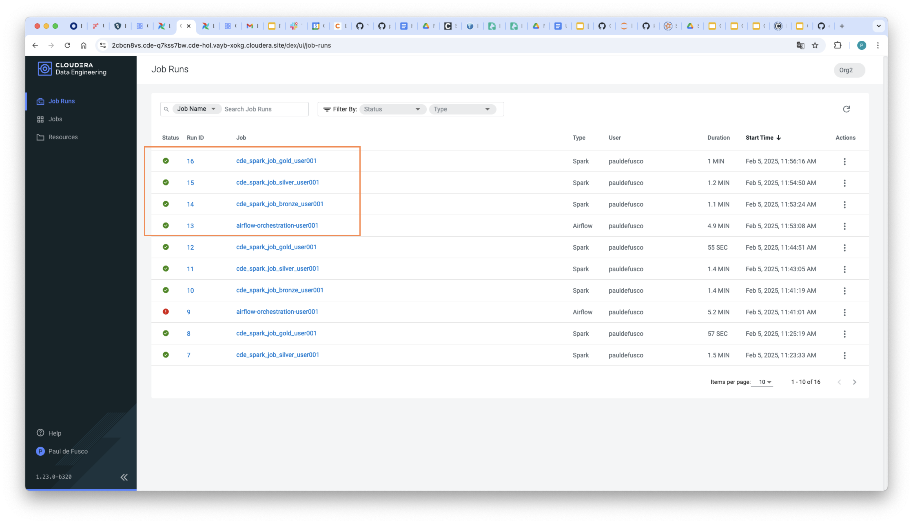

You can use the Airflow UI to inspect your pipelines. From the Virtual Cluster Details page, open the Airflow UI and then locate your Airflow DAG.

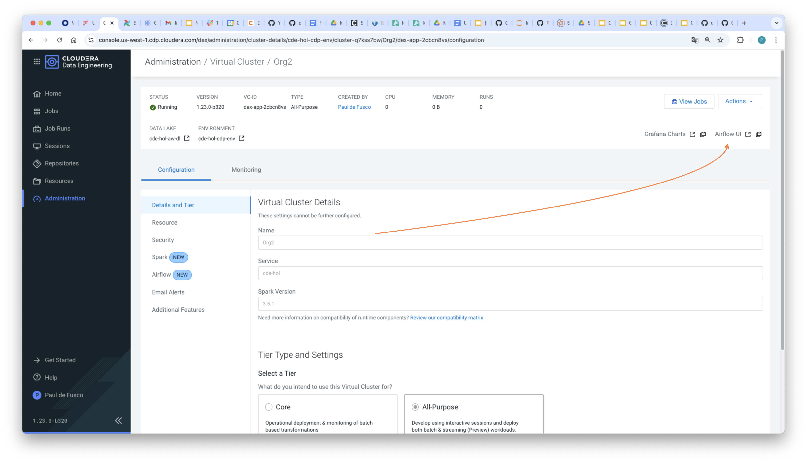

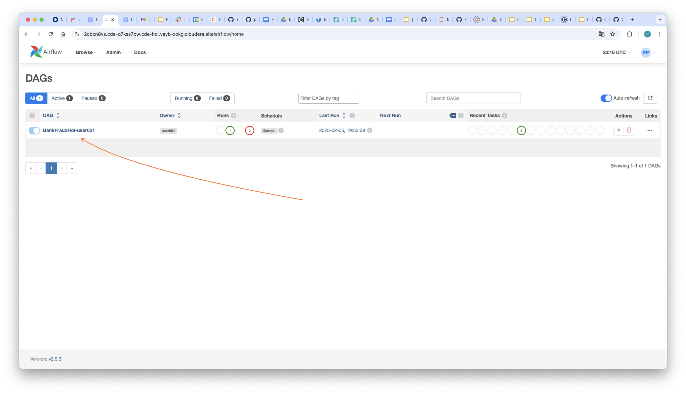

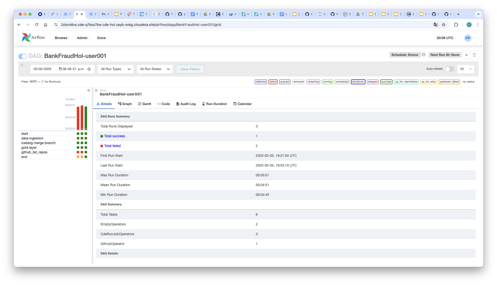

Airflow provides a variety of diagrams, charts, and visuals to monitor your executions across tasks, dags, and operators. Run your Airflow DAG multiple times from the CDE Jobs UI and come back to the Airflow UI to inspect your tasks across different runs, and more.

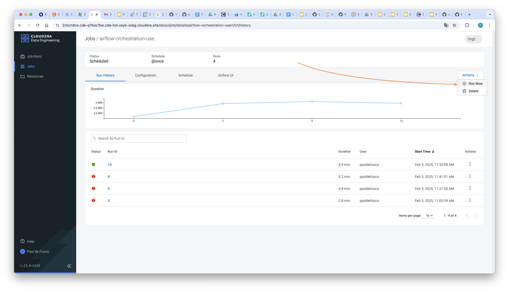

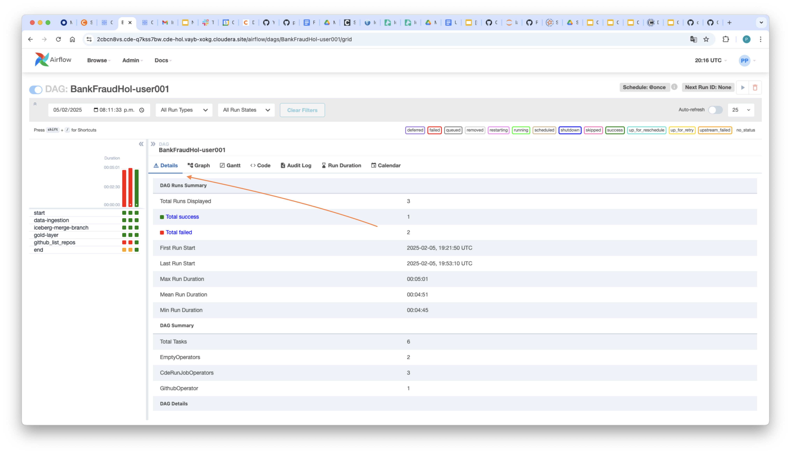

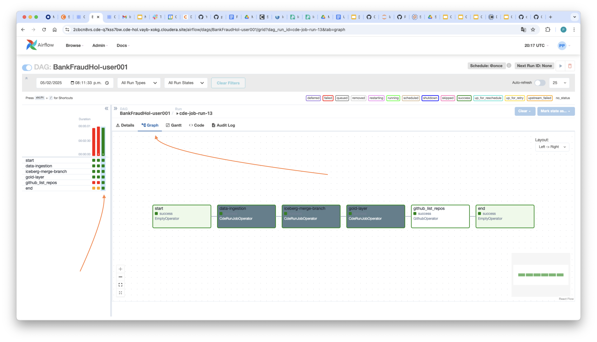

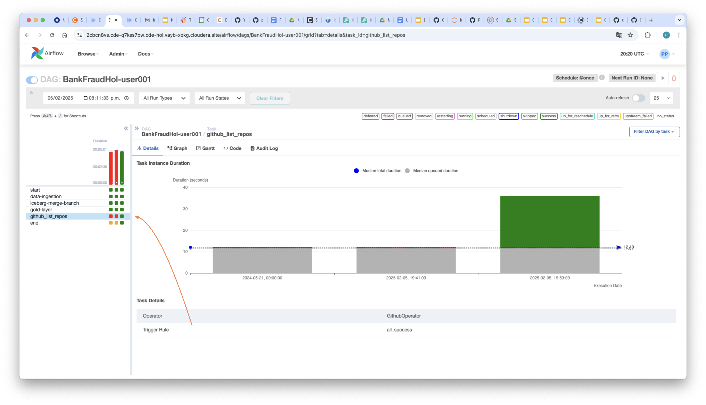

CDE Airflow supports 3rd party providers i.e. external packages that extend Apache Airflow’s functionality by adding integrations with other systems, services, and tools such as AWS, Google Cloud, Microsoft Azure, databases, message brokers, and many other services. Providers are open sourced and can be installed separately based on the specific needs of a project.

Select the GitHub List Repos Task, open the logs and notice the output is provided. In this particular task you used the GitHub Operator to list repositories from a GitHub account.

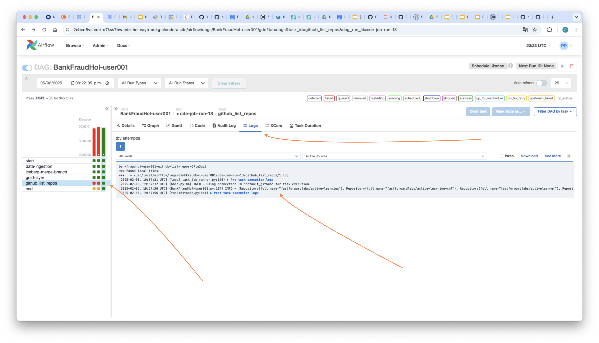

An Airflow Connection was created ahead of time to connect to this account via GitHub token. Open the Connections page to explore more connections.

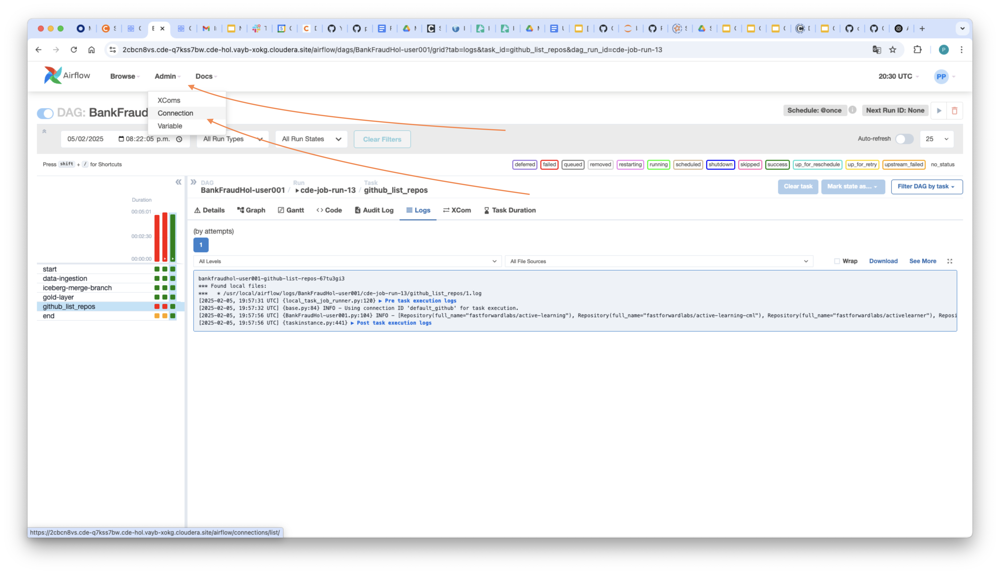

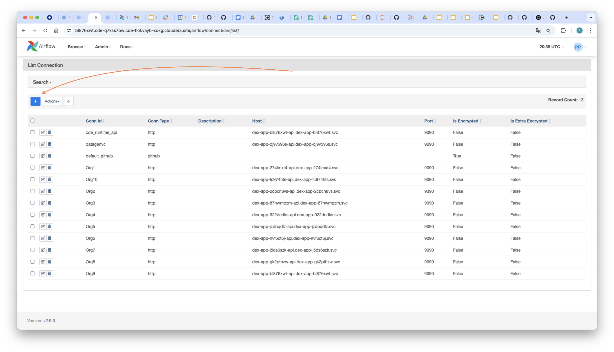

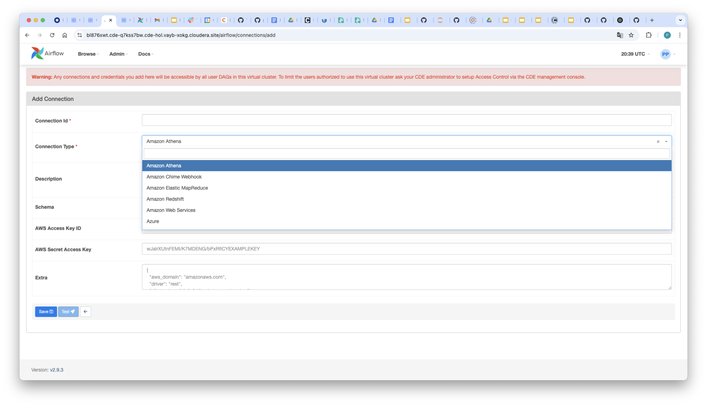

The GitHub Operator was installed in the Virtual Cluster's Airflow Python environment. Navigate back to the Virtual Cluster Details page, open the Airflow tab and validate the installed packages.

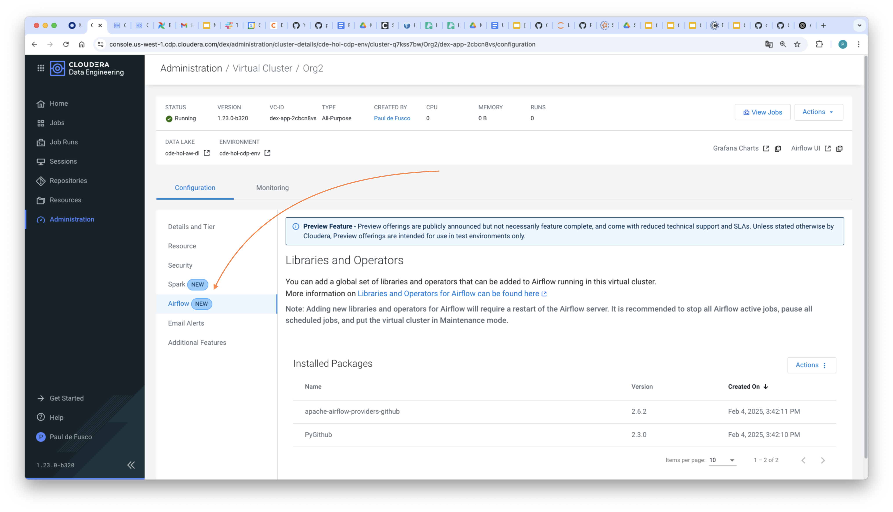


### Summary & Next Steps

Thank you and congratulations for making it all the way until the end!! Here are more helpful articles and blogs to continue your journey with Cloudera Data Engineering and Apache Iceberg:

- **Cloudera on Public Cloud 5-Day Free Trial**
   Experience Cloudera Data Engineering through common use cases that also introduce you to the platform’s fundamentals and key capabilities with predefined code samples and detailed step by step instructions.
   [Try Cloudera on Public Cloud for free](https://www.cloudera.com/products/cloudera-public-cloud-trial.html?utm_medium=sem&utm_source=google&keyplay=ALL&utm_campaign=FY25-Q2-GLOBAL-ME-PaidSearch-5-Day-Trial%20&cid=701Hr000001fVx4IAE&gad_source=1&gclid=EAIaIQobChMI4JnvtNHciAMVpAatBh2xRgugEAAYASAAEgLke_D_BwE)

- **Cloudera Blog: Supercharge Your Data Lakehouse with Apache Iceberg**  
   Learn how Apache Iceberg integrates with Cloudera Data Platform (CDP) to enable scalable and performant data lakehouse solutions, covering features like in-place table evolution and time travel.  
   [Read more on Cloudera Blog](https://blog.cloudera.com/supercharge-your-data-lakehouse-with-apache-iceberg-in-cloudera-data-platform/)

- **Cloudera Docs: Using Apache Iceberg in Cloudera Data Engineering**  
   This documentation explains how Apache Iceberg is utilized in Cloudera Data Engineering to handle massive datasets, with detailed steps on managing tables and virtual clusters.  
   [Read more in Cloudera Documentation](https://docs.cloudera.com/data-engineering/cloud/manage-jobs/topics/cde-using-iceberg.html)

- **Cloudera Blog: Building an Open Data Lakehouse Using Apache Iceberg**  
   This article covers how to build and optimize a data lakehouse architecture using Apache Iceberg in CDP, along with advanced features like partition evolution and time travel queries.  
   [Read more on Cloudera Blog](https://blog.cloudera.com/how-to-use-apache-iceberg-in-cdp-open-lakehouse/)
